# Installation and Setup Guide

## Overview

This guide provides detailed steps to:

1. Provision and configure the primary host for Jenkins, SonarQube, Grafana, and Prometheus.
2. Set up Jenkins with the necessary plugins.
3. Create and configure a Jenkins pipeline for building, testing, provisioning infrastructure, and deploying a Java application.

## Prerequisites

- A DigitalOcean account with API access.
- SSH key added to your DigitalOcean account.
- Ansible installed on your local machine.

# Step 1: Provision and Configure the Primary Host

## Terraform Configuration for Primary Host

Create a directory for your Terraform configuration files and add the following files:

`main.tf`

```hcl
provider "digitalocean" {
  token = var.do_token
}

resource "digitalocean_droplet" "main_host" {
  image  = "ubuntu-20-04-x64"
  name   = "main-host"
  region = "nyc3"
  size   = "s-2vcpu-4gb"  # Adjust the size based on your needs
  ssh_keys = [var.ssh_key_id]  # Ensure your SSH key is added to DigitalOcean
}

output "main_host_ip" {
  value = digitalocean_droplet.main_host.ipv4_address
}
```

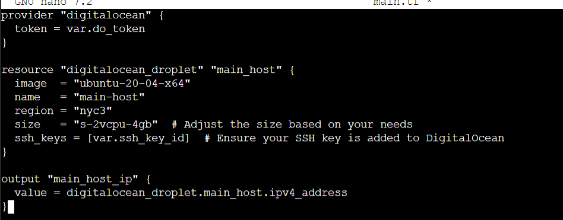

`variables.tf`

```hcl
variable "do_token" {
  description = "DigitalOcean API token"
  type        = string
}

variable "ssh_key_id" {
  description = "DigitalOcean SSH key ID"
  type        = string
}
```

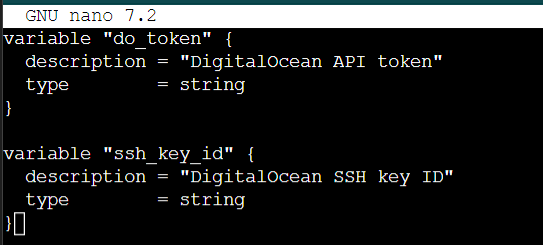

`terraform.tfvars`

```hcl
do_token = "your_digitalocean_api_token"
ssh_key_id = "your_ssh_key_id"
```

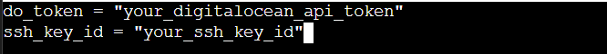
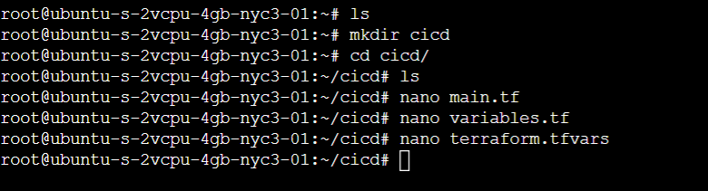

## Step-by-Step Guide to Determine and Set ansible_user

**_Step 1: Create the User (if not already created)_**
Log in to your DigitalOcean droplet and create the user:

```sh
sudo adduser deployer
```

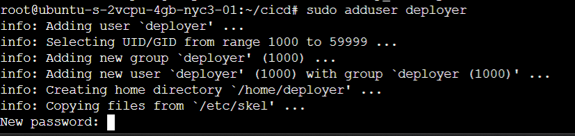

**_Step 2: Add SSH Key for the User_**
Add your public SSH key to the `~/.ssh/authorized_keys` file of the deployer user:

```sh
sudo mkdir /home/deployer/.ssh
sudo nano /home/deployer/.ssh/authorized_keys
# Paste your public SSH key into the file
sudo chown -R deployer:deployer /home/deployer/.ssh
sudo chmod 700 /home/deployer/.ssh
sudo chmod 600 /home/deployer/.ssh/authorized_keys

```

## Ansible Playbook for Setting Up Tools

Create an Ansible playbook file named `setup_tools.yml`:

```yml
- hosts: localhost
  become: yes
  vars:
    ansible_user: "deployer" # Replace with the actual user
  tasks:
    - name: Update apt cache
      apt: update_cache=yes

    - name: Install Docker
      apt:
        name: docker.io
        state: present

    - name: Install Docker Compose
      shell: curl -L "https://github.com/docker/compose/releases/download/1.29.2/docker-compose-$(uname -s)-$(uname -m)" -o /usr/local/bin/docker-compose

    - name: Set permissions for Docker Compose
      file:
        path: /usr/local/bin/docker-compose
        mode: "0755"

    - name: Start Docker service
      service:
        name: docker
        state: started
        enabled: yes

    - name: Create directories for tools
      file:
        path: "{{ item }}"
        state: directory
        mode: "0755"
      with_items:
        - /opt/jenkins
        - /opt/sonarqube
        - /opt/grafana
        - /opt/prometheus

    - name: Create Docker Compose file for Jenkins
      copy:
        dest: /opt/jenkins/docker-compose.yml
        content: |
          version: '3'
          services:
            jenkins:
              image: jenkins/jenkins:lts
              container_name: jenkins
              ports:
                - "8080:8080"
                - "50000:50000"
              volumes:
                - /opt/jenkins/jenkins_home:/var/jenkins_home
                - /var/run/docker.sock:/var/run/docker.sock

    - name: Create Docker Compose file for SonarQube
      copy:
        dest: /opt/sonarqube/docker-compose.yml
        content: |
          version: '3'
          services:
            sonarqube:
              image: sonarqube
              container_name: sonarqube
              ports:
                - "9000:9000"
              volumes:
                - /opt/sonarqube/data:/opt/sonarqube/data

    - name: Create Docker Compose file for Grafana
      copy:
        dest: /opt/grafana/docker-compose.yml
        content: |
          version: '3'
          services:
            grafana:
              image: grafana/grafana
              container_name: grafana
              ports:
                - "3000:3000"
              volumes:
                - /opt/grafana/data:/var/lib/grafana

    - name: Create Docker Compose file for Prometheus
      copy:
        dest: /opt/prometheus/docker-compose.yml
        content: |
          version: '3'
          services:
            prometheus:
              image: prom/prometheus
              container_name: prometheus
              ports:
                - "9090:9090"
              volumes:
                - /opt/prometheus/data:/prometheus

    - name: Start Jenkins
      command: docker-compose up -d
      args:
        chdir: /opt/jenkins

    - name: Start SonarQube
      command: docker-compose up -d
      args:
        chdir: /opt/sonarqube

    - name: Start Grafana
      command: docker-compose up -d
      args:
        chdir: /opt/grafana

    - name: Start Prometheus
      command: docker-compose up -d
      args:
        chdir: /opt/prometheus
```

- Run the ansible: `ansible-playbook -i localhost, -c local -u deployer --become --private-key /root/.ssh/id_rsa /root/cicd/setup_tools.yml`

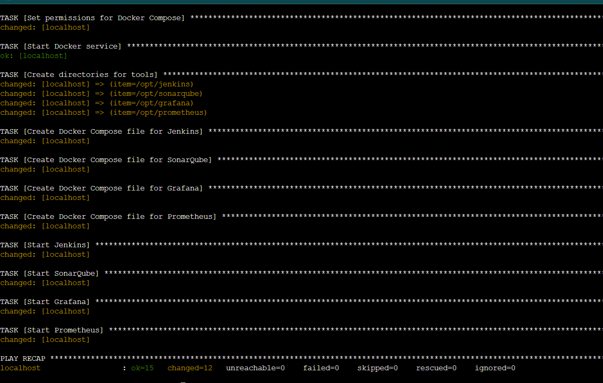

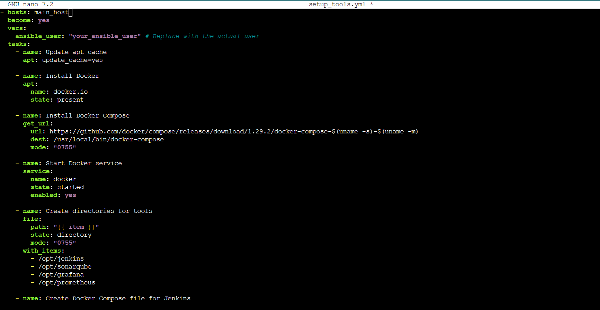

- Run the following commands to set the correct permissions on the directories:

  ```bash
    # Ensure the directories exist
    sudo mkdir -p /opt/jenkins/jenkins_home
    sudo mkdir -p /opt/sonarqube/data
    sudo mkdir -p /opt/grafana/data
    sudo mkdir -p /opt/prometheus/data

    # Set the correct permissions
    sudo chown -R 1000:1000 /opt/jenkins/jenkins_home
    sudo chown -R 1000:1000 /opt/sonarqube/data
    sudo chown -R 472:472 /opt/grafana/data
    sudo chown -R 65534:65534 /opt/prometheus/data
  ```

  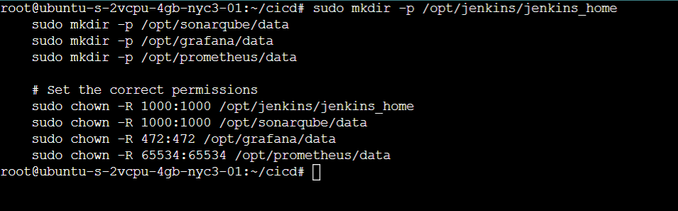

- After fixing the permissions, restart the Docker containers:

  ```bash
    docker start jenkins
    docker start sonarqube
    docker start grafana
    docker start prometheus

  ```

  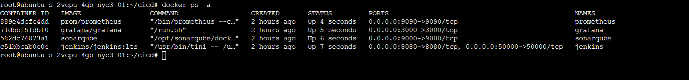

# Configure Digital SSH

You need to authenticate doctl with your DigitalOcean API token. Here’s how:

1. **_Obtain DigitalOcean API Token:_**

   - Go to your DigitalOcean Control Panel.
   - Generate a new personal access token if you don’t have one already. Copy the token.

2. **_Authenticate `doctl`:_**
   - Run the following command and paste your API token when prompted:
     ```bash
     doctl auth init
     ```
     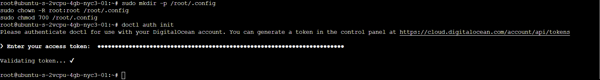
3. **_List SSH Keys_**
   - After authenticating, you can list your SSH keys to get the SSH key ID:
     ```bash
     doctl compute ssh-key list
     ```
     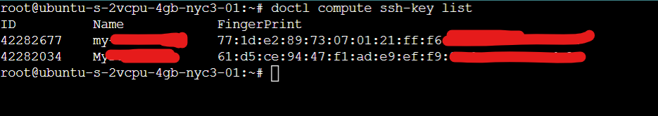

# Configure Jenkins

1. Access Jenkins Dashboard:

   - Navigate to `http://<your-jenkins-server-ip>:8080`.

2. Unlock Jenkins:

   - During the first time accessing Jenkins, you will be asked to unlock it using an initial admin password. This password is stored in the `/var/jenkins_home/secrets/initialAdminPassword` file.
     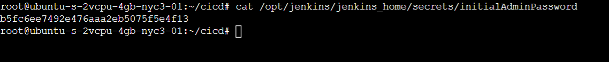

   - Retrieve the password by running the following command on your server: `sudo cat /opt/jenkins/jenkins_home/secrets/initialAdminPassword`
     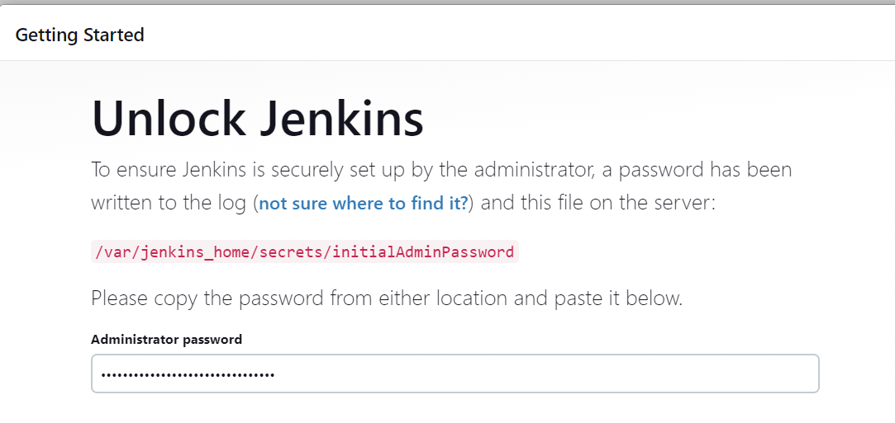
   - Enter this password in the Jenkins web interface.

3. Install Suggested Plugins:

   - Follow the prompts to install the suggested plugins. Jenkins will install the default set of plugins necessary for most CI/CD tasks.
     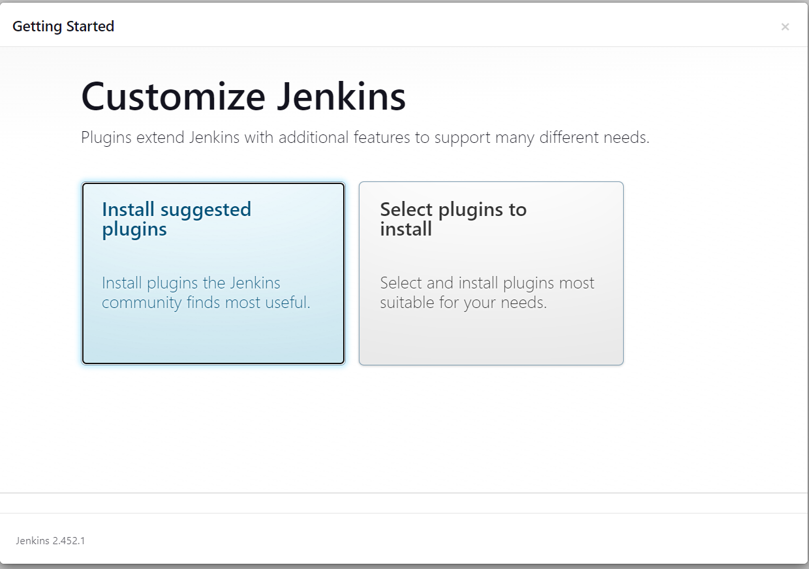
     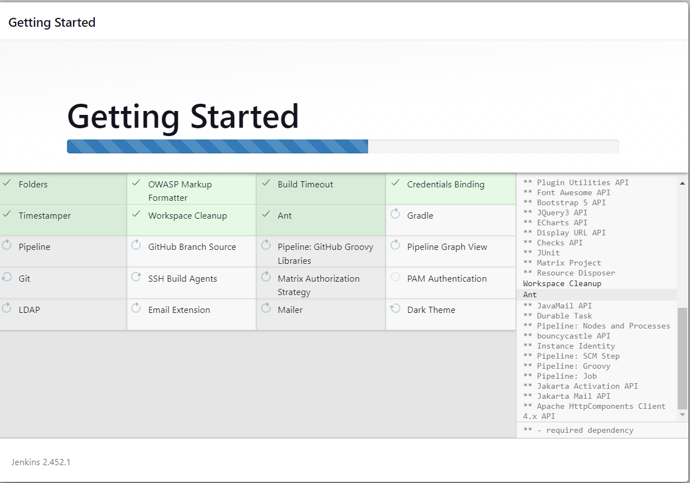

4. Create Admin User:

   - After the plugins are installed, you will be prompted to create an admin user. Fill in the required details and save.

5. Configure Jenkins URL:
   - Set the Jenkins URL to http://<your-jenkins-server-ip>:8080 when prompted.
     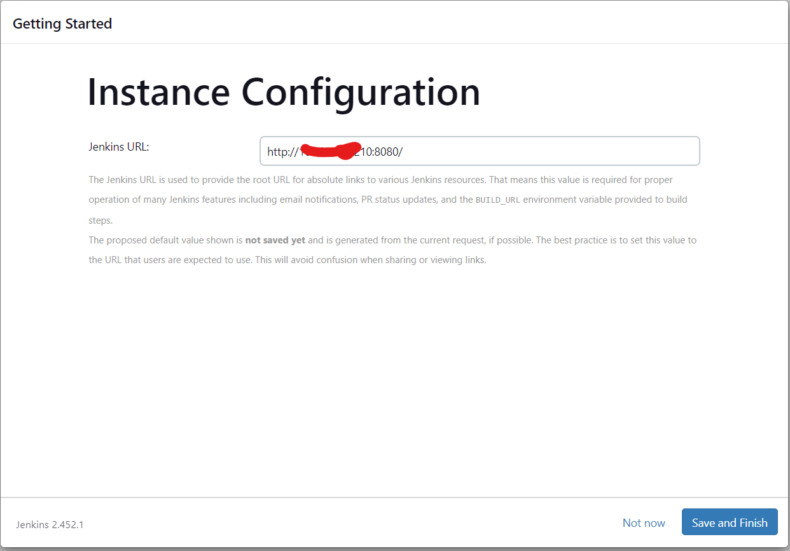

# Step 3: Install Additional Plugins

1. Manage Jenkins:

   - Go to `Manage Jenkins` > `Manage Plugins`.

2. Available Tab:

   - Search for and install the following plugins:
     - Git Plugin
     - Maven Integration Plugin
     - Terraform Plugin
     - Ansible Plugin
     - SonarQube Scanner Plugin
     - Checkmarx Plugin

   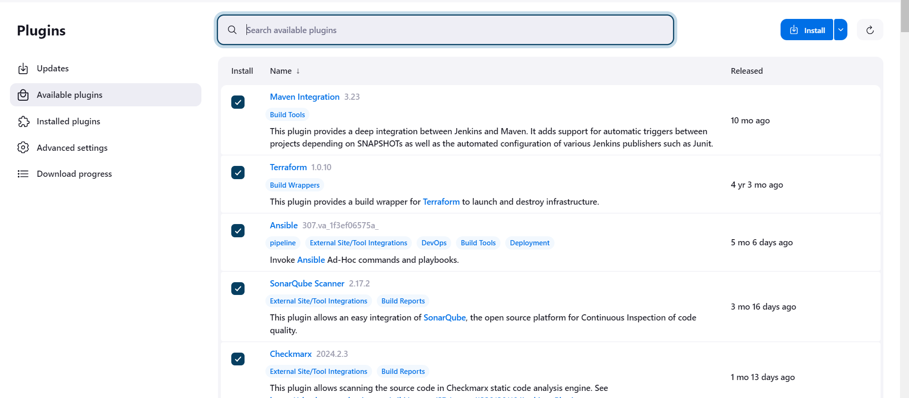

   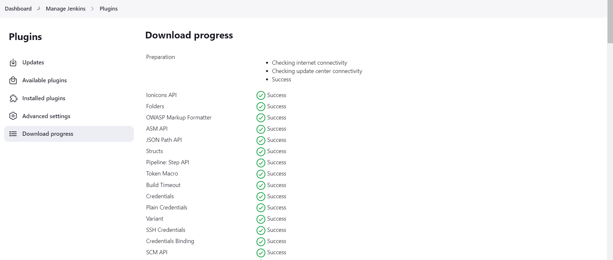

# Step 4: Configure Global Tools

1. Maven Integration Plugin:

   - Go to Manage Jenkins > Tools.
   - Under Maven, click Add Maven.
   - Provide a name (e.g., Maven 3.6.3) and specify the Maven installation method (automatic installation from Apache).

   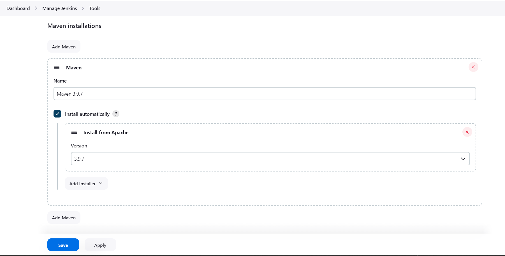

2. Ansible Plugin:

   - Go to Manage Jenkins > Tools.
   - Under Ansible, click Add Ansible.
   - Provide a name (e.g., Ansible 2.9.10) and specify the Ansible installation method (automatic installation from Ansible Galaxy).

   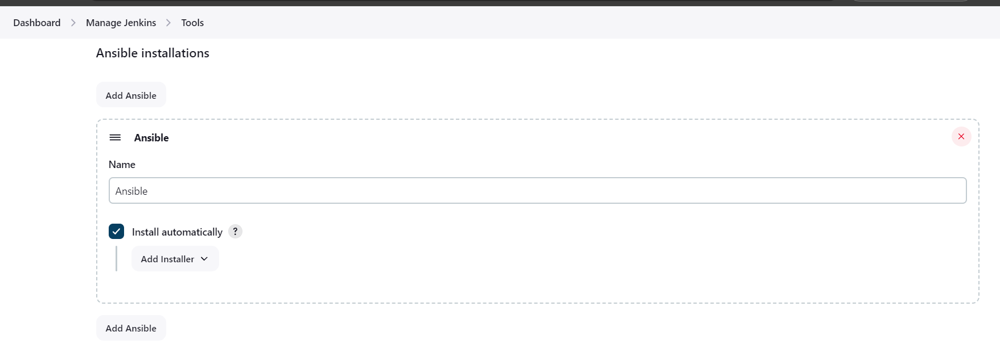

3. SonarQube Scanner Plugin:

   - Go to Manage Jenkins > System.
   - Under SonarQube servers, add a new SonarQube server.
   - Provide a name (e.g., SonarQube), the server URL (e.g., `http://<your-sonarqube-server-ip>:9000`), and an authentication token.
   - Save the configuration.

   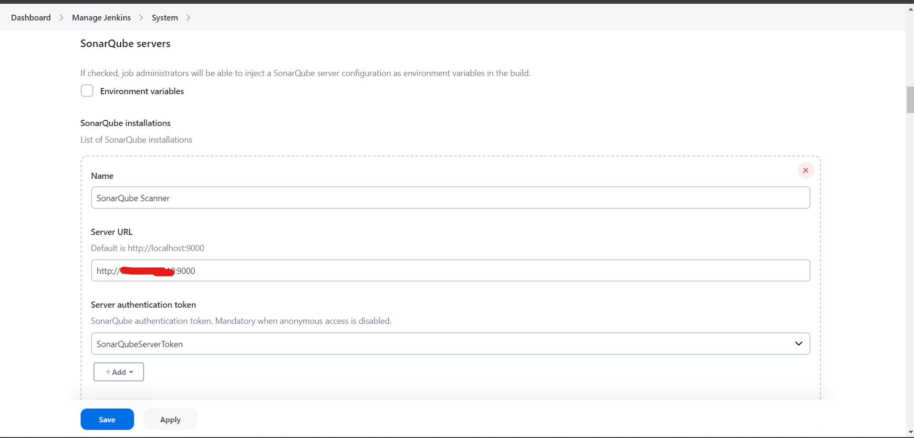
   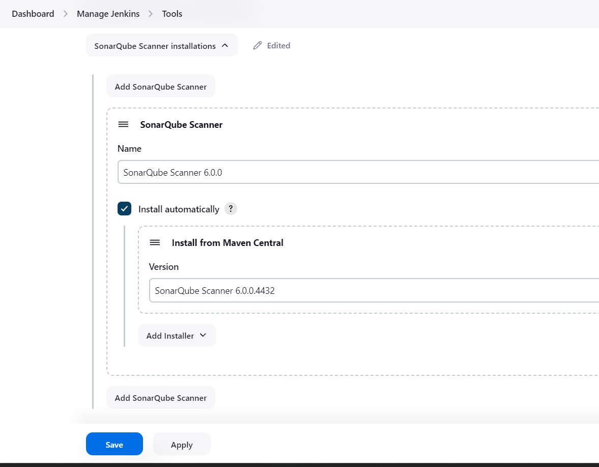

4. Checkmarx Plugin:
   - Go to Manage Jenkins > System.
   - Under Checkmarx, add a new Checkmarx server configuration.
   - Provide the necessary Checkmarx server details and credentials.
   - Save the configuration.

# Step 5: Create Jenkins Pipeline

1. Create a New Pipeline Job:

   - Go to the Jenkins dashboard.
   - Click on New Item.
   - Enter an item name (e.g., CI/CD Pipeline).
   - Select Pipeline and click OK.

2. Configure the Pipeline:
   - In the Pipeline configuration, scroll down to the Pipeline section.
   - Set the Definition to Pipeline script from SCM.
   - Set SCM to Git.
   - Provide the repository URL (e.g., https://github.com/ogeeDeveloper/Jenkins_Upgradev3.git).
   - Set the Script Path to Jenkinsfile.
